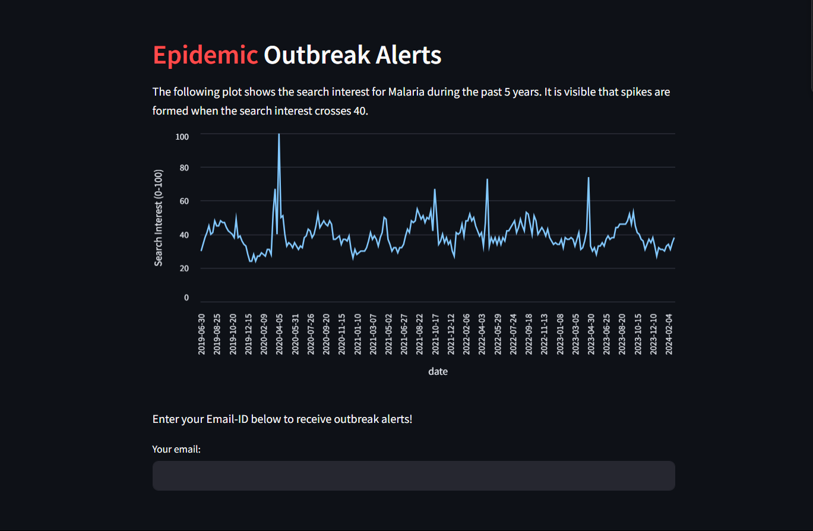

# Epidemic Outbreak Prediction

A data-driven systen to detect anomalies/spikes and raise alerts if a disease outbreak is highly likely based on real-time data.

## How It Works

The project collects data from multiple sources, including Google Search Trends, news websites, environmental dataset provided by Govt. of India and a real-time weather API from [WeatherAPI](https://www.weatherapi.com).

The insights gained from these sources are combined to form a decision on whether an outbreak for a particular disease is about to occur. Email alerts are sent automatically to the people who register for it through a Streamlit-based Web Interface.

## Data Collection

Since outbreaks can depend on multiple factors in real-world scenarios and false positives must be minimised, the project takes data from three sources into consideration before raising an alert. The data sources are -

#### 1. Google Search Trends

Google provides the search interest data for any paricular topic over a specific time period. This data is by-default normalized to a range of [0, 100], 100 being the peak number of searches and the rest of the data being relative to it.

For example, the plot below shows the search interest for Malaria in India from 2019-2024.


It is clearly visible that there is a spike whenever the search interest levels cross 40. Quite fascinating how the number of google searches alone are pretty good at detecting a rise in number of cases of a particular epidemic.

However, this pattern is different for different diseases. So we calculate the ```Z-score``` of this data and set a threshold depending on the disease (usually between 1.5 to 2). New data is collected every week and if the Z-score of this new data crosses the threshold, we can raise an alert for a possible outbreak.

#### 2. Scraping News Websites

As the second source of data, this project scrapes articles related to a disease from Google News and extracts their headlines, dates and links. The articles are then filtered based on keywords such as 'rise', 'increase', 'outbreak', etc. These filtered articles are stored in a CSV file to prepare a dataset. The number of occurences of such articles per day is counted and stored. Then a rolling average (3-day window) is calculated to smoothen the data, and a threshold is set to detect anomalies. If the number of articles in a particular day exceeds the ```threshold * rolling avg```, it is flagged as a spike and an alert is raised.

#### 3. Weather and Climate related data

A dataset containing features such as Temperature, Humidity, Precipitation, Wind Speed, Air pressure, etc is used to train a **Random Forest Classifier** which can predict if the weather conditions provide a favourable environment for the spread of Vector-borne diseases like malaria and dengue. The classifier has an accuracy of over **80%**, which is quite good as the features have a very minute direct correlation.

When the system raises an alert, the real-time weather data for those regions is fetched from an API (provided by [WeatherAPI](https://www.weatherapi.com)) and the classifier model is used to predict if the climate favours the spread of that disease. This further reinforces the alert system and minimises False positives.

## Web Interface



## Automated Email Alert

Users can enter their emails through the web interface to sign up for receiving outbreak alerts.

Basic sample of an email notifying people about a malaria outbreak.


## Future Updates

- [ ] Using Population density maps (by Meta's Data For Good) to raise high density region-specific alerts
- [ ] Epidemiological data based insights
- [ ] Improving the integration and cross-referencing between multiple data sources